# TP 31 : Microservices Spring Boot avec RabbitMQ

## Objectifs
Mise en place de deux microservices pour l'échange de messages via RabbitMQ.
1.  **JSON Messaging** : Communication simple Producer/Consumer.
2.  **MySQL Persistence** : Stockage des messages reçus en base de données.

---

## 1. Producer/Consumer (JSON)

**Configuration Initiale & Dépendances**
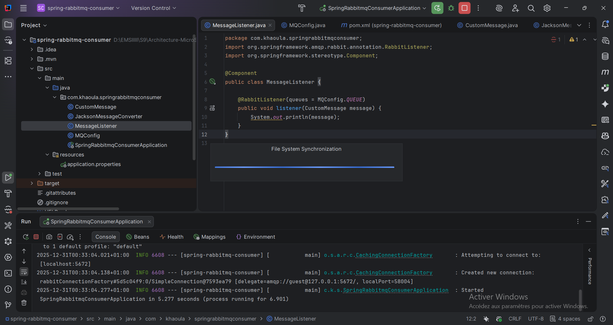
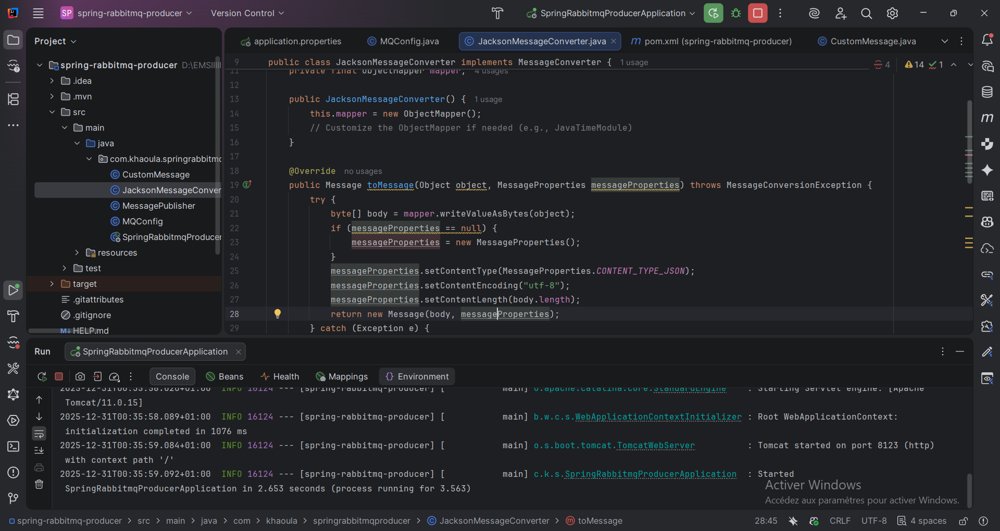

**Architecture des Projets**
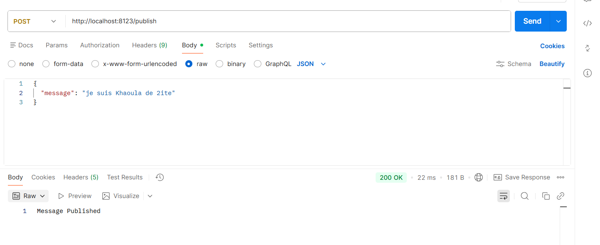

**Exécution**
Démarrage du Producer (8123) et Consumer (8223).
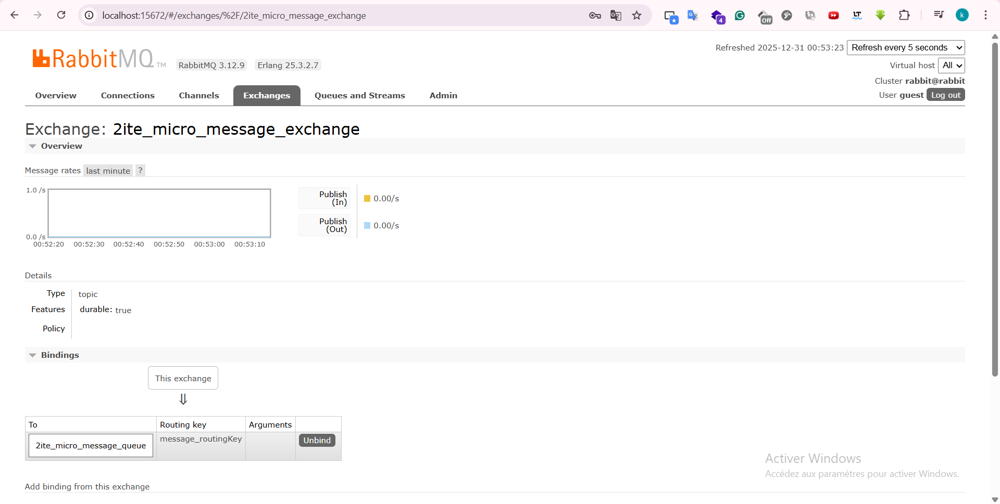
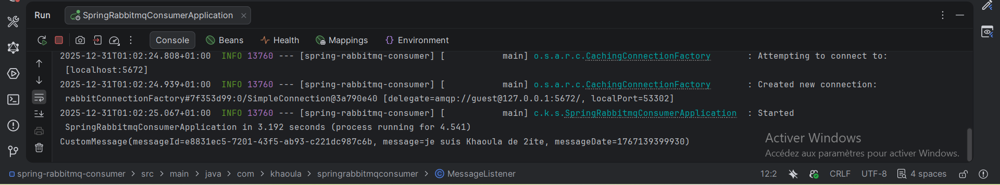

**Test & Vérification**
Envoi d'un message JSON via Postman.
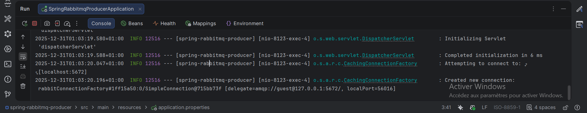

Réception confirmée dans RabbitMQ et logs.
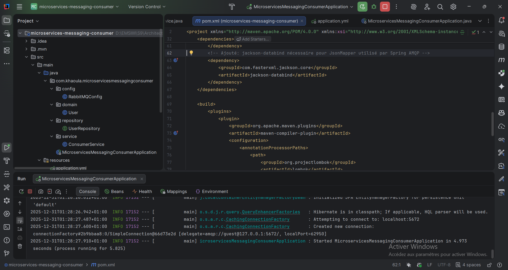

---

## 2. Persistance MySQL

**Architecture**
Producer (8081) → RabbitMQ → Consumer (MySQL).
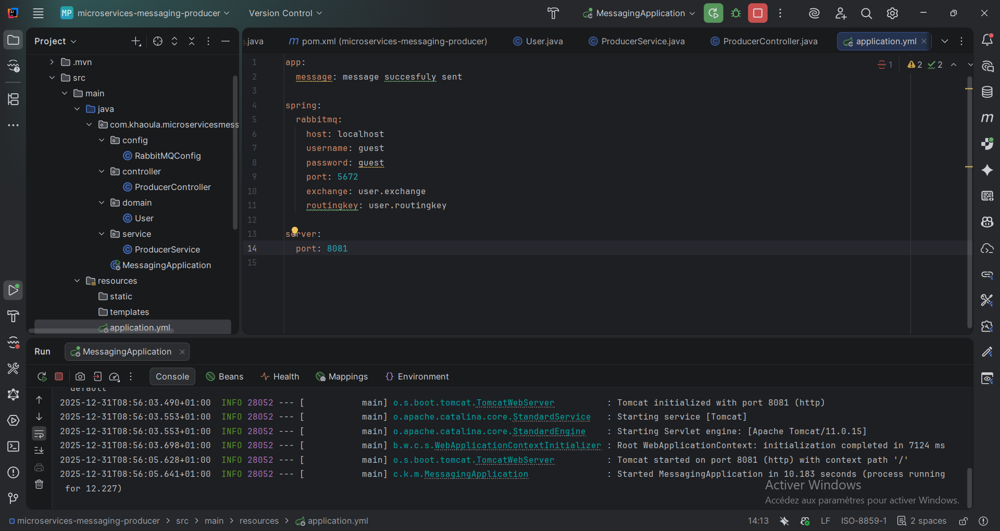

**Démarrage des Services**
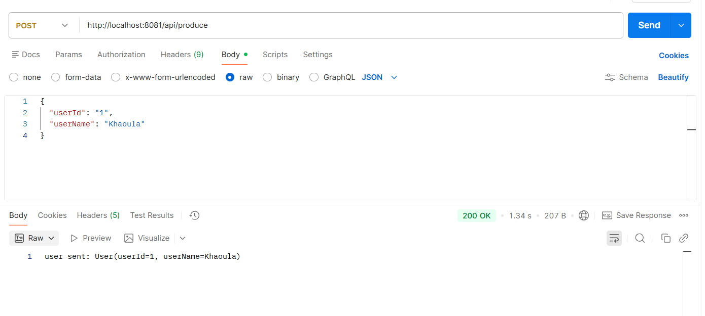
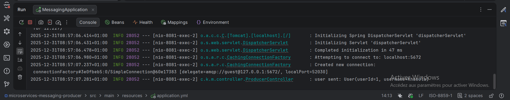

**Test de flux complet**
Envoi d'un utilisateur JSON.
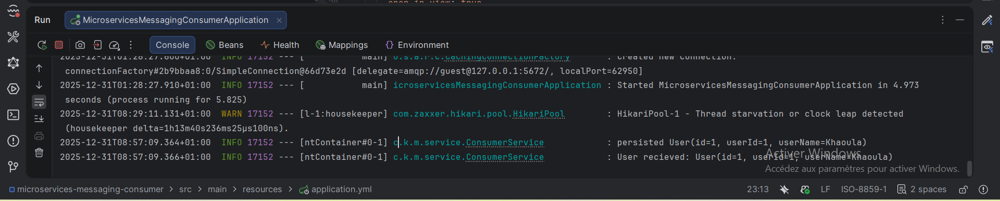

**Monitoring RabbitMQ**
Exchange `user.exchange` actif.
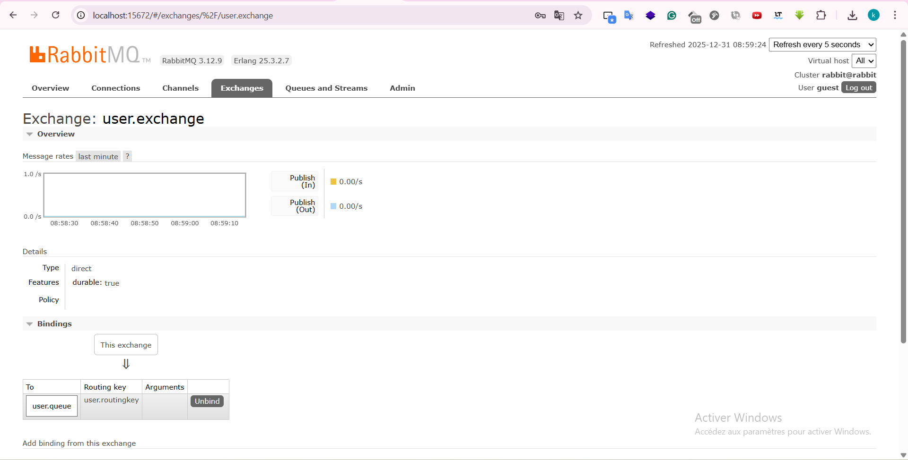

**Résultats**
Les logs confirment la persistance.
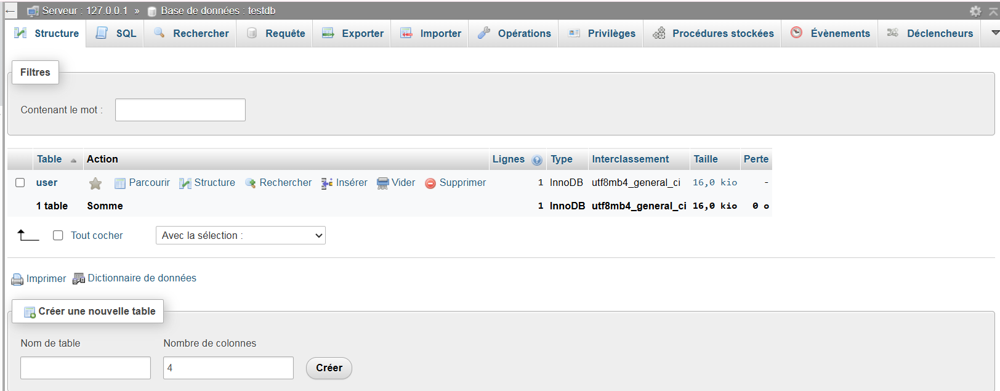

Données insérées en base MySQL.
